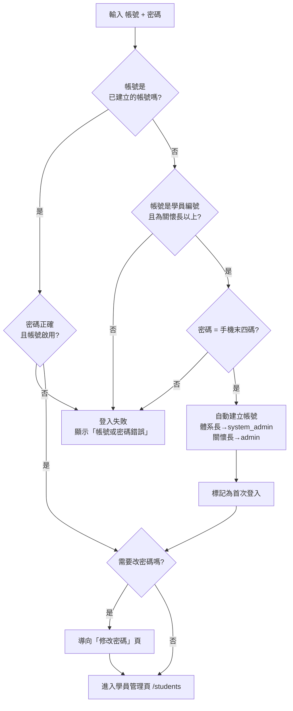

# 00 · 快速上手

← 回 [手冊目錄](./README.md)

本章帶你完成第一次登入，並認識系統的基本介面與名詞。

---

## 一、登入

系統有**兩種登入方式**，在同一個登入頁（帳號 + 密碼）操作，系統會自動判斷你屬於哪一種。

### 方式 A：已建立的帳號

如果管理者已經幫你開好帳號，直接輸入**帳號**與**密碼**登入即可。

### 方式 B：關懷長以上「自助登入」

**關懷長以上**的學員（關懷長、關懷長共同經營、體系長、體系長共同經營）不需要別人開帳號，可自己首次登入：

| 欄位 | 要填什麼 |
|---|---|
| 帳號 | 你的**學員編號（ID）** |
| 密碼 | 你**手機號碼的末四碼** |

第一次這樣登入，系統會**自動幫你建立帳號**，並依你的學員角色決定權限：

| 你的學員角色 | 自動建立的帳號角色 |
|---|---|
| 體系長 / 體系長共同經營 | **體系長**（可管理同體系帳號） |
| 關懷長 / 關懷長共同經營 | **體系管理者**（可查詢與編輯資料） |

> 自助建立的帳號會用你的**學員姓名**作為顯示名稱，並綁定你所屬的體系。

### 登入流程圖

---

## 二、首次登入強制改密碼

以下情況登入後，系統會**先要求你修改密碼**才能使用：

- 自助登入首次建立的帳號
- 管理者剛幫你開的新帳號
- 管理者剛幫你「重設密碼」之後

**操作步驟：**

| 步驟 | 動作 |
|---|---|
| 1 | 輸入**目前密碼**（自助登入者即手機末四碼；被重設者即管理者給你的臨時密碼） |
| 2 | 輸入**新密碼**（至少 8 個字元） |
| 3 | 再次輸入新密碼確認 |
| 4 | 按「更新密碼」→ 成功後自動進入學員管理頁 |

> ⚠️ 改密碼需要驗證「目前密碼」。**若忘記密碼、無法登入，請找管理者用「重設密碼」處理**（無法自己找回）。
> 系統為了安全，登入狀態約 **30 分鐘**未操作會自動失效，需重新登入。

---

## 三、介面導覽

登入後預設進入**學員管理頁**。頁面最上方是導覽列，可切換到各功能區：

| 導覽連結 | 功能 | 誰看得到 |
|---|---|---|
| 學員管理（首頁） | 學員資料表格、篩選、編輯 | 全部 |
| 儀表板 | 統計圖表、到期預警 | 全部 |
| 資料維護 | 補齊缺漏欄位 | 全部 |
| 關懷長專區 | 依分組看學員、管理分組 | 全部 |
| 心之使者 | 心之使者統計 | 全部 |
| 匯入紀錄（變更紀錄） | 匯入與手動編輯歷史 | 全部 |
| **帳號管理** | 開帳號、停用、重設密碼 | 只有系統管理者 / 體系長 |
| 登出 | 結束登入 | 全部 |
| 👤 你的名字 | 顯示目前登入者 | 全部 |

> 系統管理者的導覽列還會有**體系切換**（星光 / 太陽）；體系長與體系管理者則固定顯示自己所屬的體系，不能切換。

---

## 四、名詞解釋

| 名詞 | 說明 |
|---|---|
| **體系** | 星光 / 太陽。你多數時候只看得到自己體系的資料。學員的體系依其「業務脈」判定（業務脈為「太陽」即太陽，其餘皆星光）。 |
| **區域** | 北區 / 中區 / 南區。 |
| **角色（10 種）** | 會員、小天使、關懷員、關懷員共同經營、傳愛領袖、傳愛領袖共同經營、關懷長、關懷長共同經營、體系長、體系長共同經營。 |
| **會籍狀態** | 已過期 / 30 天內到期 / 90 天內到期 / 有效 / 無資料。 |
| **課程階段** | 一階、二階、三階、四階、五階，另有五運與特殊課程（生命數字、生命蛻變、生生世世告別負債等）。 |
| **關懷長（分組）** | 每位學員會被歸到某個「關懷長分組（group_leader）」，詳見 [03 關懷長專區與分組](./03-關懷長專區與分組.md)。 |

---

**下一步：** 依你的角色前往 [01 學員管理](./01-學員管理.md) 或（管理者）[07 帳號管理與稽核](./07-帳號管理與稽核（管理者）.md)。
