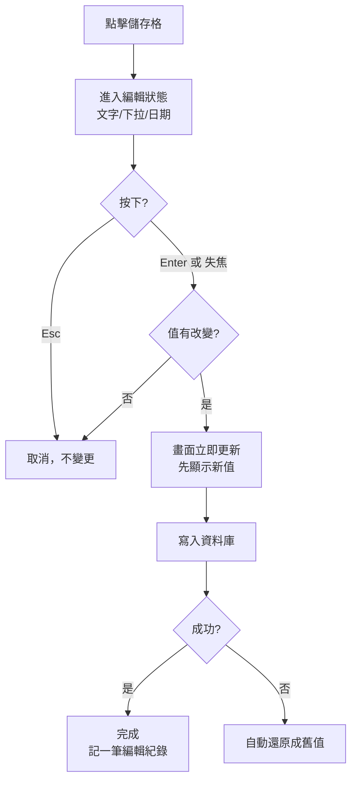

# 01 · 學員管理

← 回 [手冊目錄](./README.md)

學員管理頁（首頁 `/students`）是最主要的工作區。你可以在這裡查詢、篩選、直接編輯學員資料，並用三種檢視方式看資料。

---

## 一、三種檢視模式

頁面工具列上方可切換三種檢視：

| 模式 | 用途 |
|---|---|
| **表格** | 標準資料表，可篩選、排序、直接編輯（最常用） |
| **組織圖** | 以樹狀結構呈現學員的上下線關係，可展開/聚焦 |
| **關聯圖** | 以某位學員為中心，放射狀顯示「同期同學」與「同組組員」 |

---

## 二、表格檢視

### 工具列

| 元素 | 說明 |
|---|---|
| 體系頁籤 | 系統管理者可切換 **星光 / 太陽**；其他角色顯示自己體系（鎖定）。旁邊有目前筆數。 |
| 檢視切換 | 表格 / 組織圖 / 關聯圖 |
| **欄位** | 下拉選單，勾選要顯示/隱藏的欄位（依群組分類），可「重置顯示全部」 |
| **匯入 xlsx** | 開啟匯入精靈（詳見 [02 匯入匯出](./02-匯入匯出.md)） |
| **匯出 xlsx** | 匯出目前畫面所見的資料 |

### 篩選列

| 篩選項 | 說明 |
|---|---|
| 姓名搜尋 | 依姓名關鍵字 |
| 關懷員搜尋 | 依關懷員 |
| 區域 | 北區 / 中區 / 南區 |
| 角色 | 10 種角色下拉 |
| 課程階段 | 最高完成階：未上課 / 一階～五階 |
| 會籍狀態 | 已過期 / 30 天內 / 90 天內 / 有效 / 無資料 |
| 心之使者 | 勾選只看心之使者 |

**快捷視圖**（擇一，互斥）：

| 快捷鈕 | 篩出的對象 |
|---|---|
| 續報潛力 | 有續報可能的學員 |
| 待催欠款 | 尚有欠款待催的學員 |
| 會籍快到期 | 會籍即將到期的學員 |
| 本月新生 | 本月新加入的學員 |
| **同名學員** | 體系內姓名完全相同、且有 2 人以上的學員 |

> **關於「同名學員」**：用來**辨識**體系內有哪些人同名，避免查詢時找錯人。結果會把同名者**相鄰排列**方便比對。
> 判定為「姓名完全相同」（僅忽略前後空白），且**只在自己體系內比對**（星光的王小明不會和太陽的王小明互相配對）。
> ⚠️ 同名**不代表資料重複或錯誤**——很可能就是兩位不同的人。是否需要處理請自行確認，系統不會自動合併或刪除。

> 設定任何篩選後，會出現「已套用篩選數量」與「✕ 清除」。姓名/關懷員/區域/角色會同步到網址，方便把篩選後的畫面分享或還原。右側「更新：…」是資料最後更新時間（每分鐘自動更新）。

### 表格操作

| 操作 | 怎麼做 |
|---|---|
| 排序 | 點欄位標題 |
| 調整欄寬 | 拖曳欄位右邊界 |
| 固定欄 | 編號與姓名欄固定在左側，不隨橫向捲動移動 |
| 換頁 | 每頁 100 筆，用「上一頁 / 下一頁」；顯示「共 N 筆・第 X / Y 頁」 |
| 手機檢視 | 螢幕寬度小於 768px 時，改為卡片列表（點擊展開，**唯讀**） |

---

## 三、直接編輯儲存格（重要）

表格中大多數欄位可以**點一下直接改**，不用進別的頁面。

| 動作 | 按鍵 |
|---|---|
| 開始編輯 | 點該儲存格（或按 Enter / 空白鍵） |
| 儲存 | 按 **Enter**，或點到別處（失焦） |
| 取消 | 按 **Esc** |

依欄位型別，編輯時會變成文字框、下拉選單或日期選擇器。

### 編輯儲存格流程圖

> **每一次成功編輯都會被記錄**（誰、改了哪個學員的哪個欄位、從什麼改成什麼），可在 [06 變更紀錄](./06-變更紀錄.md) 的「手動編輯」查詢。
> 若儲存失敗（例如網路問題），畫面會自動還原成原本的值，不會留下錯誤資料。

---

## 四、組織圖檢視

以樹狀結構呈現學員上下線：

- 搜尋框可找特定學員
- 麵包屑顯示目前層級路徑（全體系 → …）
- 每個節點顯示下線人數，可展開/收合
- 點節點可聚焦（drill-in）到該學員

---

## 五、關聯圖檢視

以某位學員為中心的放射狀關係圖（需要時才載入）：

| 顏色 | 關係 |
|---|---|
| 藍色 | 同期同學（同一期上課） |
| 琥珀色 | 同組組員（同一心之使者小組） |

- 搜尋一位學員 → 顯示其關係圖
- 可拖曳節點、縮放平移
- 滑鼠移到節點上會顯示關係原因
- 點其他成員節點可重新以他為中心

---

## 六、新增學員

> ⚠️ **現況提醒**：程式中存在「新增學員」表單（編號、姓名、性別、地區、角色、手機），但目前**畫面上沒有按鈕可以開啟它**（疑似尚未接上）。
> 目前實務上新增學員請用**匯入 xlsx**（見 [02 匯入匯出](./02-匯入匯出.md)）。若需要單筆手動新增的按鈕，請回報以便補上。

若日後接通，該表單行為為：輸入編號（必填、正整數）與姓名（必填），可選填性別/地區/角色/手機；體系依目前頁籤決定（太陽頁籤 → 業務脈設為太陽，否則視為星光）；編號重複會提示「此編號已存在」。

---

**相關手冊：** [04 資料維護](./04-資料維護專區.md)（補齊缺漏欄位）、[03 關懷長專區與分組](./03-關懷長專區與分組.md)（依分組看學員）。
