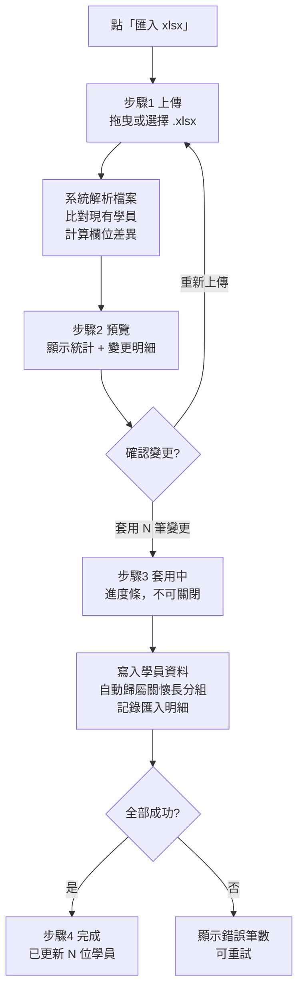

# 02 · 匯入匯出

← 回 [手冊目錄](./README.md)

本章說明如何用 Excel（xlsx）批次匯入學員資料，以及如何把目前畫面的資料匯出。

---

## 一、匯入 xlsx（四步驟精靈）

匯入刻意分成**兩階段**：先「預覽」看清楚會改動什麼，確認後才「套用」寫入資料庫。**在你按下套用前，資料庫不會有任何變動。**

**入口**：學員管理頁工具列上的藍色 **匯入 xlsx** 按鈕。

### 匯入流程圖

### 步驟 1：上傳

把 `.xlsx` 檔拖進上傳區、或點選擇檔案。系統會解析檔案：

- 讀取**第一個工作表**；**第一列為標題列**。
- 系統會依標題文字自動對應欄位，所以**欄位順序可以不同**。若某標題無法辨識，會用預設的欄位位置。
- 學員**編號**取自「系統編號」欄（或從姓名欄解析）。沒有姓名、或無法判斷編號的列會被略過。

### 步驟 2：預覽

會看到四個統計數字：

| 統計 | 意義 |
|---|---|
| 來源資料列 | 檔案裡的資料筆數 |
| 比對到學員 | 對應到現有學員的筆數 |
| 欄位變更 | 有變動的欄位總數 |
| 新學員 | 檔案中屬於全新學員的人數 |

下方是**變更明細表**（學員 / 欄位 / 原始值 / 新值 / 類型）：

| 顏色 | 類型 |
|---|---|
| 綠底 | 新增（insert）——新學員的欄位 |
| 琥珀底 | 更新（update）——既有學員有變動的欄位 |

> 舊值以紅字、新值以綠字顯示。若變更超過 1,000 筆，只顯示前 1,000 筆並提示。

按 **← 重新上傳** 可換檔；按 **套用 N 筆變更** 開始寫入（沒有任何變更時，套用鈕會停用）。

### 步驟 3：套用中

寫入時**不能關閉視窗**（進度條會跑到接近完成）。系統會：

1. 讀取剛才預覽存下的資料。
2. 把每筆變更寫入「匯入明細」（供日後在變更紀錄查閱）。
3. **自動把每位學員歸到關懷長分組**（規則見 [03 關懷長專區與分組](./03-關懷長專區與分組.md)）。
4. 分批寫入學員資料。

> **冪等保護**：同一次匯入若已套用過，再按也不會重複寫入。
> **失敗可重試**：若中途有批次寫入失敗，該次匯入**不會**被標記為完成，可修正後重試。

### 步驟 4：完成

顯示 ✅「匯入完成 · 已更新 N 位學員資料」。若有失敗，會以紅字顯示失敗筆數。此次匯入會記一筆操作稽核（套用匯入），管理者可在 [07 帳號管理與稽核](./07-帳號管理與稽核（管理者）.md) 查到。

---

## 二、xlsx 欄位對應要點

系統用**標題文字**對應欄位，同一個欄位可接受多種常見寫法：

| 你的標題可能寫 | 系統對應到 |
|---|---|
| 輔導員 / 關懷員 | 關懷員（counselor） |
| 輔導長 / 關懷長 / 傳愛領袖 | 關懷長（senior counselor） |
| 系統編號 | 學員編號（ID） |

匯入會處理的欄位涵蓋：編號、姓名、性別、角色、聯絡方式、介紹人/關係、業務脈、關懷員、小天使、解夢師、關懷長、區域、輔導脈、會籍，以及所有課程/付款階段（一階～五階、五運與 A–F、生命數字、生命蛻變等）。日期會自動正規化。

> 詳細的欄位新增/調整屬於開發範疇，請參考開發文檔 [`docs/04-import-pipeline.md`](../04-import-pipeline.md)。

---

## 三、匯出 xlsx

**入口**：學員管理頁工具列的 **匯出 xlsx** 按鈕。

| 特性 | 說明 |
|---|---|
| **匯出＝畫面所見** | 會帶入你目前的所有篩選（姓名、關懷員、區域、角色、課程階段、會籍狀態、心之使者、快捷視圖），匯出結果與畫面一致。 |
| 體系範圍 | 只會匯出你**目前體系**的資料（由伺服器決定，確保不會匯到別體系）。 |
| 內容 | 一個工作表，含粗體凍結標題列、自動欄寬、斑馬紋。涵蓋編號、姓名、性別、角色、聯絡、介紹人、業務脈、關懷員…以及所有課程/付款階段。 |
| 檔名 | `學員名單_<體系>_<日期>.xlsx` |
| 誰可以匯出 | 任何登入者（範圍限自己體系）。每次匯出會記一筆操作稽核（資料匯出）。 |

> 儀表板頁另有獨立的小型 Excel 匯出（例如「會籍到期預警清單」），見 [05 儀表板與心之使者](./05-儀表板與心之使者.md)。

---

**相關手冊：** [03 關懷長專區與分組](./03-關懷長專區與分組.md)（分組如何自動歸屬）、[06 變更紀錄](./06-變更紀錄.md)（查匯入歷史）。
