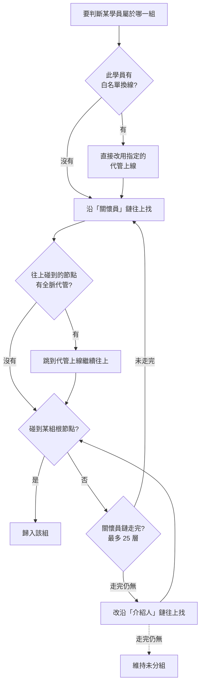

# 03 · 關懷長專區與分組

← 回 [手冊目錄](./README.md)

關懷長專區（`/counselors`）讓你依「關懷長分組」檢視與管理學員，並維護分組的歸屬規則。

---

## 一、依分組檢視學員

- 頁面上方是**分組頁籤**（例如目前約 9 組，實際組別由系統設定，可能增減）。
- 點某個分組，下方就顯示該組學員，操作方式與 [01 學員管理](./01-學員管理.md) 的表格相同（篩選、快捷視圖、欄位顯示、直接編輯都一樣）。
- 系統管理者可切換體系；體系長/體系管理者鎖定自己體系。

---

## 二、什麼是「分組歸屬」？

每位學員都會被歸到一個**關懷長分組**。系統靠一套規則自動判斷他屬於哪一組——沿著他的「上線鏈」往上找，直到碰到某組的「根節點」。

### 歸屬判斷順序（優先序）

重點整理：

| 規則 | 說明 |
|---|---|
| 優先序 | **白名單換線（單人）** → **全脈代管（整條線）** → 關懷員鏈 → 介紹人鏈 |
| 最多層數 | 往上追溯最多 25 層 |
| 跨體系隔離 | 學員只會被歸到**同體系**的組（太陽學員不會落到星光組） |
| 不覆蓋手動 | 若自動判斷不出來，會**保留**原本手動設定的分組，不清空 |

> ⚠️ **重要**：白名單換線與全脈代管這兩種例外，**只有在執行「批次重新計算歸屬」時才會套用**；一般匯入時的自動歸屬只走關懷員鏈/介紹人鏈。所以設定完例外後，記得跑一次批次重算（見下）。

---

## 三、管理分組

點 **管理分組** 按鈕，開啟三頁面板：

### 頁籤 1：分組管理

| 動作 | 說明 |
|---|---|
| 檢視 | 每組顯示名稱、排序、根節點學員 ID |
| 排序 | 用上/下箭頭調整組別順序 |
| 編輯 | 改組名、改根節點 ID（多個以逗號分隔） |
| 刪除 | 移除該組 |
| 新增 | 填組名 + 根節點 ID 建立新組 |
| **⚡ 批次重新計算歸屬** | 見下方 |

#### 批次重新計算歸屬（Backfill）

按 **開始重新執行計算**，系統會對**全體學員**重新套用歸屬規則（含白名單換線與全脈代管），再一次更新每個人的分組。會顯示進度，完成後回報「已更新 / 總數」。

> **何時要跑？**
> - 新建或修改了分組（改了根節點）
> - 設定或調整了「全脈代管」「白名單換線」
> 這些變更**不會自動生效**，要跑一次批次重算才會套用到所有學員。

### 頁籤 2：全脈代管

把**某條整線**改掛到代理上線之下。

| 欄位 | 說明 |
|---|---|
| 原始上線 ID | 原本的介紹人/上線 |
| 代理上線 ID | 要改掛到誰之下 |
| 備註 | 例如「李雨珊不在星光時，劃給郭芷萱」 |

**效果**：追溯上線鏈時，一碰到「原始上線」就跳到「代理上線」，於是**整條下線**都跟著改歸屬。

### 頁籤 3：白名單換線

把**特定幾位學員**強制改掛到新的上線（比全脈代管更精準、只動指定的人）。

| 步驟 | 動作 |
|---|---|
| 1 | 輸入原上線 ID，拉出他的直屬下線清單 |
| 2 | 搜尋/勾選要搬動的特定學員 |
| 3 | 指定新的代理上線 ID（+ 選填備註）→ 建立 |
| — | 也可刪除換線、就地編輯備註 |

**效果**：換線的優先序**高於**全脈代管（先檢查換線），所以只有被勾選的那幾位學員改歸屬，其他人不受影響。

---

## 四、常見情境對照

| 我想…… | 用哪個功能 |
|---|---|
| 新增一個關懷長分組 | 管理分組 → 分組管理 → 新增 |
| 某位關懷長離開，他底下整條線改由別人帶 | 全脈代管 |
| 只把某幾位學員換到別的上線 | 白名單換線 |
| 剛改完分組/例外，讓全部學員重新歸位 | 批次重新計算歸屬 |
| 某學員「未分配組別」 | 見 [04 資料維護專區](./04-資料維護專區.md)（或先跑批次重算） |

---

**相關手冊：** [02 匯入匯出](./02-匯入匯出.md)（匯入時的自動歸屬）、[04 資料維護專區](./04-資料維護專區.md)（處理未分組學員）。
