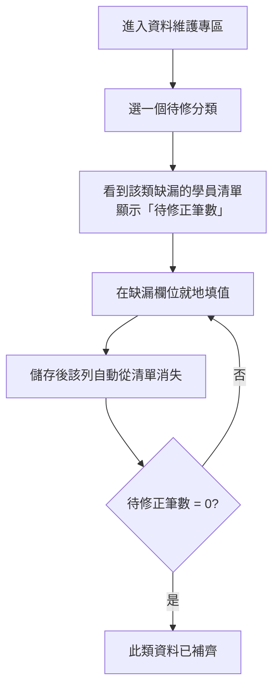

# 04 · 資料維護專區

← 回 [手冊目錄](./README.md)

資料維護專區（`/maintenance`）是一份「待修清單」——把**缺了關鍵欄位**的學員集中列出，讓你就地補齊。

---

## 一、三類待修資料

頁面上方的分類頁籤，各對應一種資料缺漏：

| 分類頁籤 | 篩出的對象 | 怎麼補 |
|---|---|---|
| **未分配組別** | 還沒有關懷長分組的學員 | 手動填分組，或到 [03 關懷長專區](./03-關懷長專區與分組.md) 跑「批次重新計算歸屬」批次處理 |
| **關懷長空白** | 關懷長欄位是空的 | 直接在該欄填入關懷長 |
| **關懷體系空白** | 輔導脈（關懷體系）是空的 | 直接填入 |

選一個分類，下方就只列出「有這個缺漏」的學員。

---

## 二、操作流程

| 特性 | 說明 |
|---|---|
| 就地編輯 | 與 [01 學員管理](./01-學員管理.md) 的儲存格編輯完全相同（點一下改、Enter 存、Esc 取消） |
| 自動移除 | 補好缺漏欄位後，該列就符合條件、自動從待修清單消失 |
| 篩選 | 可用姓名、關懷員、區域、角色進一步縮小清單 |
| 待修正筆數 | 上方顯示還剩幾筆要處理 |
| 體系範圍 | 只顯示你所屬體系的資料（系統管理者可切體系） |
| 稽核 | 每次補值都會記入「手動編輯」紀錄（見 [06 變更紀錄](./06-變更紀錄.md)） |

---

## 三、小訣竅

- **「未分配組別」通常最快的處理方式**是到 [03 關懷長專區](./03-關懷長專區與分組.md) 按一次「批次重新計算歸屬」——它會依上線鏈自動幫大多數人歸位，剩下真的追溯不到的少數才需要手動指定。
- 「關懷長空白」「關懷體系空白」則多半需要逐筆確認後手動補。

---

**相關手冊：** [01 學員管理](./01-學員管理.md)（同樣的編輯操作）、[03 關懷長專區與分組](./03-關懷長專區與分組.md)（批次歸屬）。
