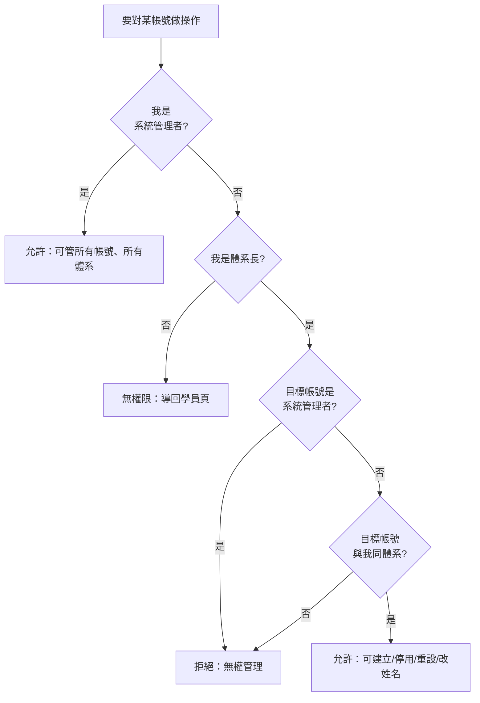
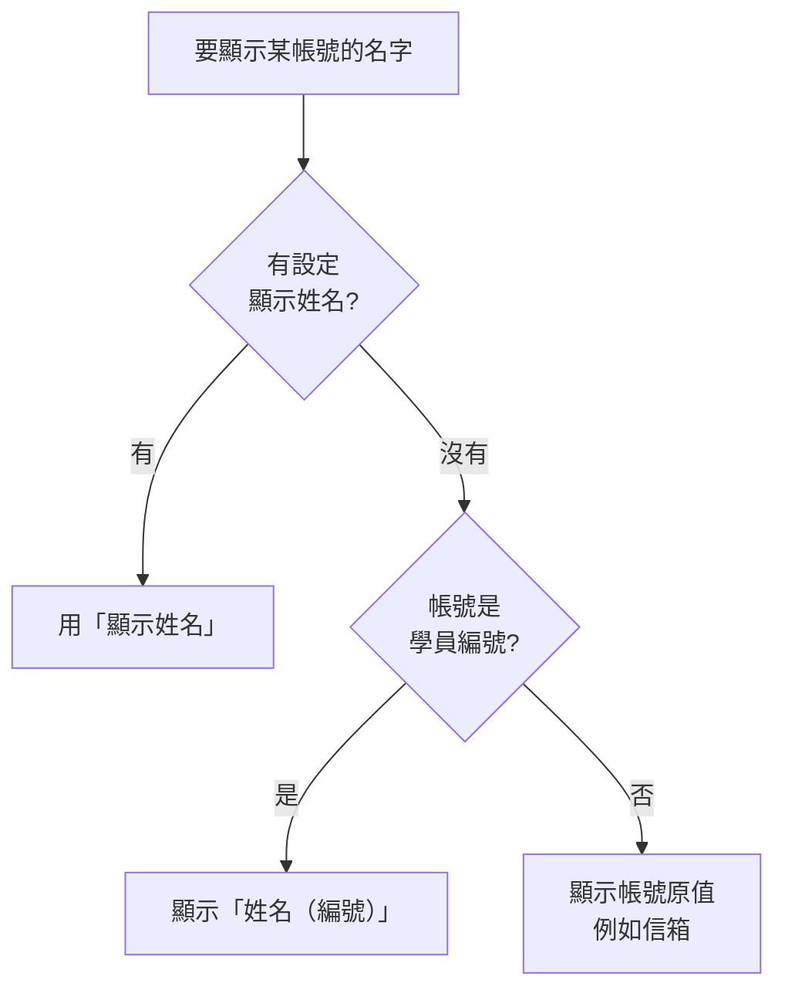

# 07 · 帳號管理與稽核（管理者專用）

← 回 [手冊目錄](./README.md)

本章只適用於**系統管理者**與**體系長**。體系管理者（admin）沒有這些功能，進入相關頁面會被導回學員頁。

---

## 一、角色權限（先搞懂誰能做什麼）

| 功能 | 系統管理者 (superadmin) | 體系長 (system_admin) |
|---|:---:|:---:|
| 進入帳號管理 / 稽核頁 | ✅ | ✅ |
| 管理的帳號範圍 | 全部（跨體系） | **只限同體系** |
| 建立系統管理者 | ✅ | ❌ 不允許 |
| 建立體系長 / 體系管理者 | ✅（可指定體系） | ✅（強制在自己體系） |
| 切換體系 | ✅ | ❌ |

### 帳號管理權限判定流程圖

---

## 二、帳號管理 `/admin/users`

### 建立帳號

填入以下欄位後送出：

| 欄位 | 說明 |
|---|---|
| 帳號 | 登入用帳號（不可與現有重複，否則提示「帳號已存在」） |
| 初始密碼 | 給對方的第一組密碼（對方首次登入會被強制改） |
| 顯示姓名（選填） | 登入紀錄/列表顯示的姓名；留空則自動退回（見下方「顯示姓名規則」） |
| 角色 | 體系管理者 / 體系長 /（僅系統管理者可選）系統管理者 |
| 體系 | 系統管理者可選星光/太陽；體系長固定為自己體系 |

> 新帳號一律標記為「首次須改密碼」。建立會記一筆操作稽核（建立帳號）。

### 每列帳號的操作

| 按鈕 | 作用 | 稽核動作 |
|---|---|---|
| **改姓名** | 設定/清除該帳號的顯示姓名（清空則退回姓名規則） | 改顯示姓名 |
| **重設密碼** | 給一組新密碼，對方**下次登入須再改** | 重設密碼 |
| **停用 / 啟用** | 切換帳號是否可登入 | 停用帳號 / 啟用帳號 |

限制與提醒：

- **停用即時生效**：被停用的帳號下一個動作就會失效。
- **不能停用自己**的帳號。
- **沒有「刪除帳號」**：帳號只會被停用，不會真正刪除。
- 列表會顯示解析後的姓名，若與帳號不同會在底下以小灰字標出原帳號；有「待改密碼」的帳號會標示。

### 顯示姓名規則

系統決定畫面上顯示什麼名字的優先序：

| 情況 | 顯示結果 |
|---|---|
| 有填顯示姓名 | 該姓名 |
| 沒填，但帳號是學員編號（自助登入者） | 姓名（編號），例如 `王小明（1234）` |
| 沒填，且帳號不是學員編號（例如信箱帳號） | 帳號原值（信箱） |

> 想讓信箱型帳號顯示姓名，用該帳號的 **改姓名** 補上即可。

---

## 三、登入紀錄 / 操作稽核 `/admin/login-logs`

此頁用頁首切換兩種來源。

> 目前兩種紀錄**不分體系**：體系長會看到全系統的登入/稽核紀錄（不限自己體系）。顯示最新在前，上限 500 筆。

### 來源 1：登入紀錄

記錄每次登入相關事件。

| 欄位 | 說明 |
|---|---|
| 時間 / 帳號 / 事件 / IP / 瀏覽器 | 事件有：登入成功、登入失敗、改密碼 |
| 篩選 | 依帳號（部分比對）、依事件類型 |

### 來源 2：操作稽核

記錄管理與資料類的敏感操作。

| 欄位 | 說明 |
|---|---|
| 時間 / 操作者 / 動作 / 對象・內容 / IP | — |
| 篩選 | 依操作者 |

**會被記錄的動作：**

| 動作 | 何時產生 |
|---|---|
| 建立帳號 | 帳號管理新增帳號 |
| 啟用帳號 / 停用帳號 | 切換帳號狀態 |
| 重設密碼 | 幫他人重設 |
| 改顯示姓名 | 改帳號顯示姓名 |
| 資料匯出 | 匯出 xlsx |
| 套用匯入 | 匯入套用完成 |

> 登入紀錄與操作稽核都會把操作者/帳號解析成姓名顯示（規則同上）。稽核寫入為盡力而為，即使記錄失敗也不會影響你正在做的操作。

---

## 四、常見管理情境

| 我想…… | 怎麼做 |
|---|---|
| 幫新關懷長開帳號 | 帳號管理 → 建立帳號（其實關懷長以上可自助登入，通常不必手動開） |
| 有人忘記密碼登不進 | 帳號管理 → 該列「重設密碼」，把新密碼給他，他下次登入會被要求改 |
| 某人離職停用帳號 | 帳號管理 → 該列「停用」 |
| 讓信箱型管理帳號顯示姓名 | 帳號管理 → 該列「改姓名」 |
| 查誰匯出過資料 / 誰停用了帳號 | 登入紀錄頁 → 切「操作稽核」 |
| 查某帳號登入是否異常 | 登入紀錄頁 → 「登入紀錄」，依帳號篩選看成功/失敗 |

---

**相關手冊：** [00 快速上手](./00-快速上手.md)（自助登入與角色）、[06 變更紀錄](./06-變更紀錄.md)（資料層級的異動紀錄）。
